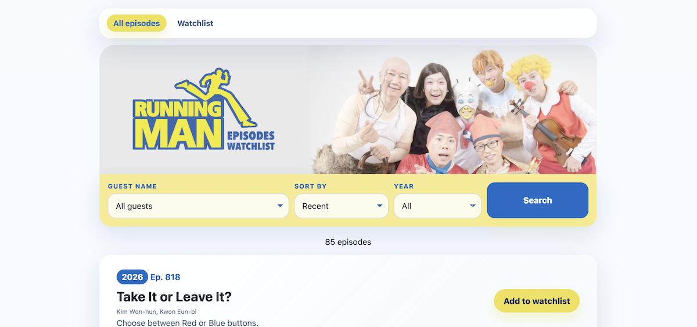
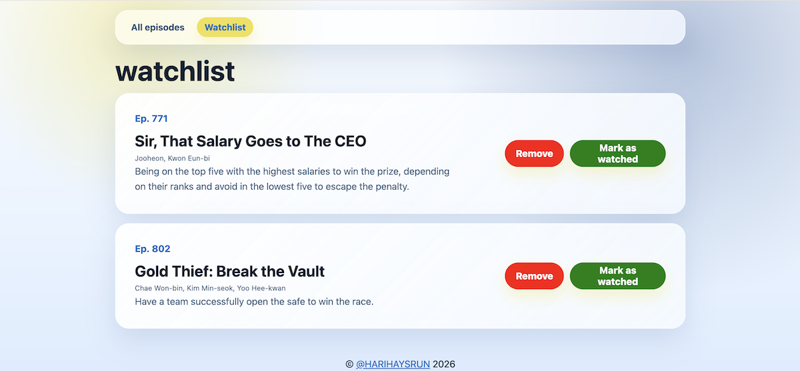
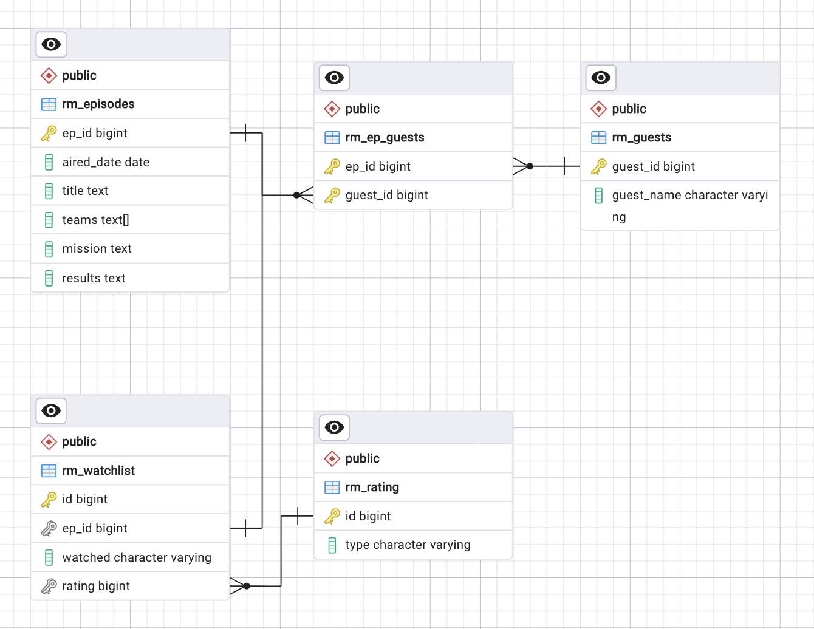

# Running Man Episode Tracker

An automated ETL pipeline that scrapes *Running Man* episode data, transforms and stores it in PostgreSQL, and makes the data available through an interactive Flask web application.

### Tech Stack

- **ETL:** Python, Pandas, SQLAlchemy, PostgreSQL
- **Orchestration:** Apache Airflow
- **Cloud:** AWS S3
- **Infrastructure:** Docker
- **Web:** Flask, Jinja2

## Pipeline

```text
Wikipedia
    ↓
Python / BeautifulSoup
    ↓
AWS S3 (Raw JSON)
    ↓
Pandas (Transformation)
    ↓
PostgreSQL
    ↓
Flask Web Application
```

### 1. Extraction

`rm_scraper.py` scrapes the [Running Man episode list on Wikipedia](https://en.wikipedia.org/wiki/List_of_Running_Man_episodes_(2026)) using BeautifulSoup4. The extracted data is stored as JSON in S3, with HTML tags removed during extraction.

### 2. Transformation

`rm_transform.py` uses Pandas to clean and standardise the extracted data, including column names, data formats, data types, and guest information.

### 3. Loading

`rm_load.py` loads the transformed data into PostgreSQL using Pandas and SQLAlchemy, with parameterised queries and context-managed database connections.

### 4. Orchestration & Automation

The ETL pipeline is currently automated using **GitHub Actions**, with a scheduled workflow that runs the pipeline weekly.

**Apache Airflow** is included for local orchestration and testing, with the pipeline containerised using Docker.
## Web Application

A Flask-based dashboard provides:

- Episode search and filtering
- Add and remove episodes from a watchlist

**[Live Demo](https://nsy-rm-etl-49d98b403757.herokuapp.com/)**

<details>
<summary><b>View the UI</b></summary>




</details>

## Database

<details>
<summary><b>View the ERD</b></summary>



</details>

## Project Structure

```text
rm-episodes-tracker-etl/
├── .github/workflows/    # CI/CD
├── airflow/              # Airflow DAG
├── data/                 # Sample raw and cleaned data
├── data_pipeline/        # ETL scripts
├── database/             # SQL schema & ERD
└── web_app/              # Flask application