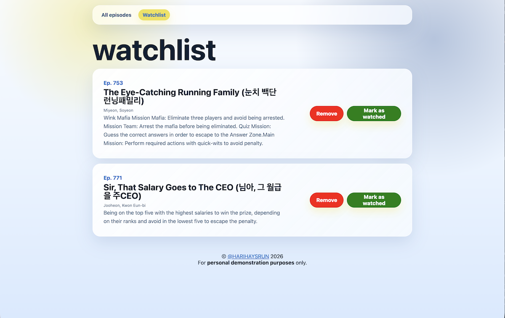

# Running Man Data Engineering Pipeline

A fully automated ETL pipeline that scrapes, processes, and visualises *Running Man* episode data.

### Tech Stack
* **Python:** The core logic engine.
* **PostgreSQL:** Persistent relational storage.
* **SQLAlchemy:** Secure ORM and connection handling.
* **Pandas:** Efficient data frame processing.
* **GitHub Actions:** CI/CD for automated pipeline scheduling.
* **Flask & Jinja2:** Backend and frontend dashboard implementation.

---

## How the pipeline works

### 1. Extraction (E): Web scraping
`rm-scraper.py` initiates by accessing the [Running Man episode list on Wikipedia](https://en.wikipedia.org/wiki/List_of_Running_Man_episodes_(2026)) using `BeautifulSoup4`. Due to the complex structure of the HTML table (with multiple rowspans), data is stored in a grid list to preserve the exact positioning of the cell values before being cached in an Excel file.
* Removal of HTML tags is performed during this step.

### 2. Transformation (T): Data refinement
The Excel file is passed into `rm-transform.py`, which utilises `pandas` for further data manipulation. This stage involves:
* **Normalisation:** Standardising column headers and data formats.
* **Data cleaning:** Fixing data types and converting guest name lists into a comma-separated format.
* **Validation:** Ensuring that the final output is a clean, ready-to-ingest CSV file for the loading phase.

### 3. Loading (L): Database persistence
`rm-load.py` bridges the cleaned CSV file to the PostgreSQL database using a high-performance ingestion workflow:

* **Efficient data ingestion:** Utilises `pandas.read_sql` and `SQLAlchemy` to perform seamless data transfer from DataFrames into PostgreSQL.
* **Production-ready standards:** The load process is fully automated using context managers for secure connection handling and parameterised queries for safe data ingestion.

<details>
<summary><b>Click here to view the database schema (ERD)</b></summary>


</details>


---

## Automation with GitHub Actions
To eliminate manual intervention, the entire pipeline is orchestrated by **GitHub Actions**, a resource-efficient alternative to Apache Airflow.
* A cron-based workflow triggers the Python scripts in sequence on a weekly schedule. This creates a "set-and-forget" data environment where the database is continuously kept in sync with the latest episodes.

---

## Full-stack dashboard & watchlist

<details>
<summary><b>Click here to view the UI</b></summary>



</details>

Beyond the engineering pipeline, this project includes an interactive web dashboard built on `Flask` and `Jinja2`. This serves as the visualisation layer, allowing users to:
* **Explore episodes:** Search and filter through the complete episode database.
* **Personal watchlist:** Maintain a custom state for episodes, demonstrating basic CRUD (Create, Read, Update, Delete) capabilities within the web app.

---

## Project Structure

```text
rm-episodes-tracker-etl/
├── .github/workflows/    # CI/CD pipelines
├── database/             # SQL schema
├── data-pipeline/        # Core ETL logic (scraper, transform, load) & requirements.txt for cron job
└── web-app/              # Flask dashboard (templates, static assets, app.py)